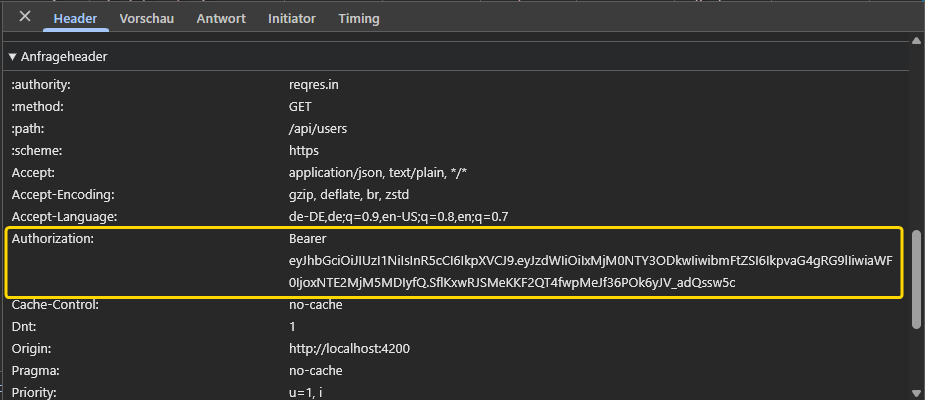

# Angular Table Sort + Interceptor Demo 📋🔒

Diese Angular 19 Demo zeigt, wie man eine Liste von Benutzern von der API `reqres.in` lädt,
sie in einer sortierbaren Tabelle anzeigt und einen Bearer JWT-Token 
an den HTTP-Request über einen **Interceptor** mitsendet.

## 🛠️ Verwendete Technologien

- Angular 19
- HTTP Client (für API-Anfragen)
- Interceptor (für das Hinzufügen des Bearer Tokens)
- RxJS (für die asynchrone Datenbehandlung)

## ⚙️ Funktionsweise

1. **Benutzer laden:** Die Benutzer werden von der öffentlichen API `https://reqres.in/api/users` geladen.
2. **Sortierbare Tabelle:** Die Benutzer werden in einem HTML Table dargestellt, die nach verschiedenen Spalten sortiert werden kann (z. B. Name, E-Mail).
3. **Interceptor:** Ein **HTTP Interceptor** wird verwendet, um einen **Bearer JWT-Token** zu jedem API-Request hinzuzufügen.

## 🚀 Lokales Setup

```
git clone https://github.com/ronnymundt/angular-table-sort-interceptor-demo.git
cd angular-table-sort-interceptor-demo
npm install
ng serve
```

## 🎥 Screencast


## 📸 Screenshot


